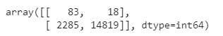

# Overview of the analysis
Credit risk is an inherently unbalanced classification problem, as good loans easily outnumber risky loans. Therefore, different techniques need to be emplyed to train and evaluate models with unbalanced classes. 

Using the credit card credit dataset from LendingClub, a peer-to-peer lending services company, data is oversampled using the RandomOverSampler and SMOTE algorithms, and undersampled using the ClusterCentroids algorithm. Then, a combinatorial approach of over- and undersampling using the SMOTEENN algorithm was used. Next, two new machine learning models that reduce bias are compared, BalancedRandomForestClassifier and EasyEnsembleClassifier, to predict credit risk. 

## Deliverables

* Deliverable 1: Use Resampling Models to Predict Credit Risk
* Deliverable 2: Use the SMOTEENN Algorithm to Predict Credit Risk
* Deliverable 3: Use Ensemble Classifiers to Predict Credit Risk
* Deliverable 4: A Written Report on the Credit Risk Analysis (README.md)

## Results
### Deliverable 1 (Oversampling and Under Sampling)
* An accuracy score for the model is calculated to 0.99
* A confusion matrix has been generated 

* An imbalanced classification report has been generated 

### Deliverable 2 (SMOTEENN -  Combination of Over and Under Sampling)

* An accuracy score for the model is calculated to be 0.82
* A confusion matrix has been generated 

* An imbalanced classification report has been generated 

### Deliverable 3 

#### The BalancedRandomForestClassifier algorithm does the following:

* An accuracy score for the model is calculated 
* A confusion matrix has been generated 
* An imbalanced classification report has been generated 
* The features are sorted in descending order by feature importance 
##### The EasyEnsembleClassifier algorithm does the following:
* An accuracy score of the model is calculated 
* A confusion matrix has been generated 
* An imbalanced classification report has been generated 

## Summary
* Compared to all models EasyEnsemble model gave the best accuarcy while balanced accuracy has the least accuracy.
* Hence I recommend EasyEnsemble model.

